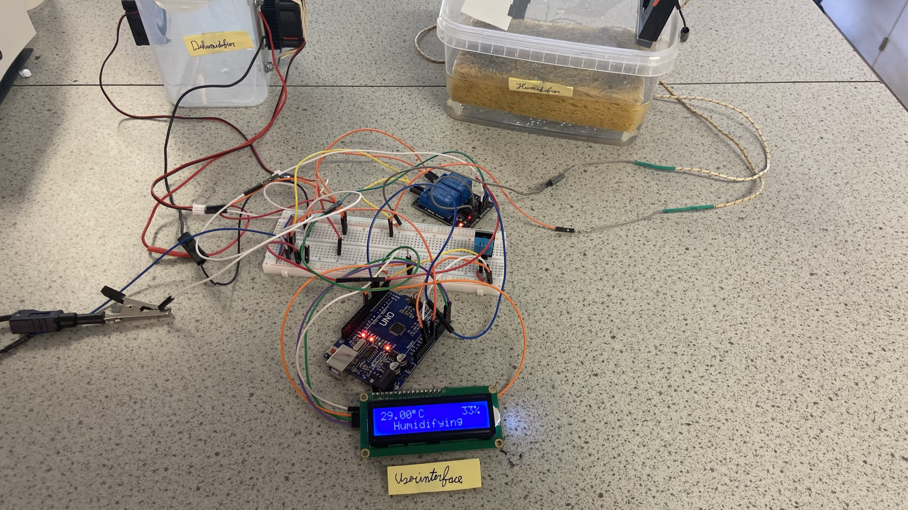
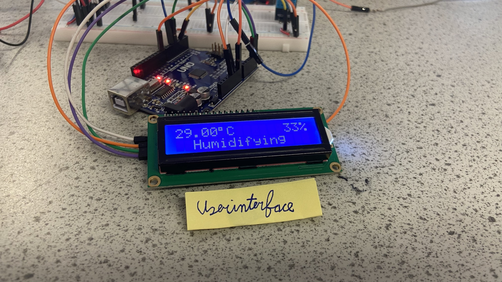
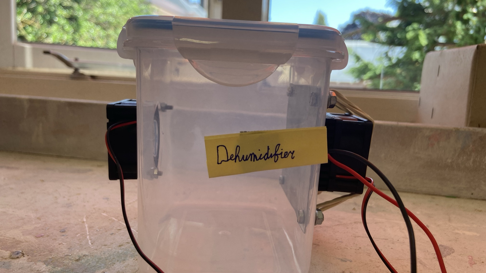
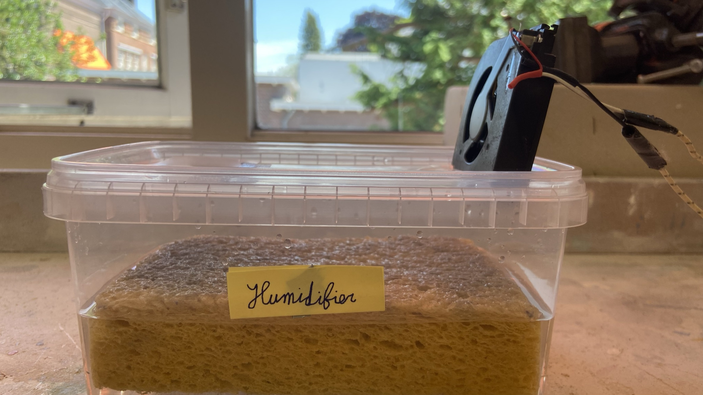

# Arduino-humidity
A school project to read the humidity and act on that data with an arduino. The code is found in the file [arduino-humidify.ino](./arduino-humidify.ino), so this folder can be imported directly into the arduino IDE.

## What it exactly does
* It reads the temperature and humidity with a DHT_11 module.
* Two times per minute it checks the humidity.
  * If it's below 40%, the humidifier is activated
  * If it's above 55%, the dehumidifier is activated
* Every 15 seconds, the arduino prints the temperature, humidity and time in the serial monitor.
  * It includes tabs so you can copy-paste the result directly into excel.  
* It shows the temperature, humidity and status to the LCD screen
  * When the status changes, the backlight binks a couple times

# Components
This project uses the DHT_11 and LCD (16x2) module. The humidifier and dehumidifier are custom build and controlled by a relay.

## Schematic

## Pinout
* DHT_11 Sensor: `Digital 2`
* Dehumidifier relay: `Digital 4`
* Humidifier relay: `Digital 5`
* LCD Backlight: `Digital 8`
* LCD sda: `Analog 4`
* LCD scl: `Analog 5`
> And of course, the vcc and ground.

# Pictures
| Overview                           | User interface                               |
|------------------------------------|----------------------------------------------|
|  |  |

| Dehumidifier                               | Humidifier                             |
|--------------------------------------------|----------------------------------------|
|  |  |

# License
This project is licensed under [MIT](./LICENSE), so feel free to use, modify, etc the code however you want!